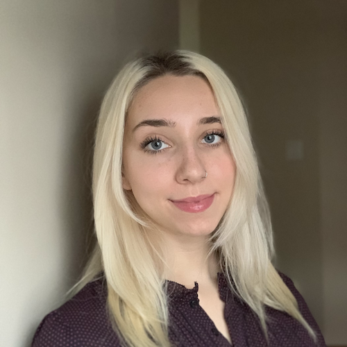

# Meet Your Faculty

#### Shraddha Pai

>Investigator I, OICR  
Assistant Professor, University of Toronto  
>

Dr. Pai integrates genomics and computational methods to advance precision medicine. Her previous work involves DNA methylome-based biomarker discovery in psychosis, and building machine learning algorithms for patient classification from multi-modal data. The Pai Lab at the Ontario Institute for Cancer Research focuses on biomarker discovery for detection, diagnosis and prognosis in brain cancers and other brain-related disorders.

#### Chaitra Sarathy

>Bioinformatics Specialist  
Krembil Research Institute  
>

Dr. Sarathy is a computational biologist with industry experience in software development. Her previous research centered around developing multi-scale mathematical models of human systems to characterise biochemical changes in obesity. In addition, she has developed methods based on machine learning and multi-omics integration to identify drug targets in cancer and stratify patients for clinical trials. She currently focuses on characterizing genetic malfunctions in neurological diseases.

#### Ian Cheong

>MSc. Candidate  
University of Toronto  
>

Ian is a Master’s level candidate in the Department of Medical Biophysics at the University of Toronto. His thesis work in the Pai lab involves analysis of single-cell transcriptomes to find the link between brain development and the development of childhood brain cancer.

#### Zoe Klein

>PhD. Candidate  
University of Toronto  
>

Zoe is a PhD level candidate in the Department of Molecular Genetics at the University of Toronto. Her thesis work in the Reimand lab involves using computational tools to investigate the role of non-coding RNA in cancer. 

#### Nia Hughes (she/her)

>Platform Training Manager, Canadian Bioinformatics Hub 
Ontario Institute for Cancer Research 
Toronto, ON, Canada
>
> --- training@bioinformatics.ca

Nia is the Platform Training Manager for the Canadian Bioinformatics Hub, where she coordinates the Canadian Bioinformatics Workshop Series. Prior to starting at OICR, she completed her M.Sc. in Bioinformatics from the University of Guelph in 2020 before working there as a bioinformatician studying epigenetic and transcriptomic patterns across maize varieties.

